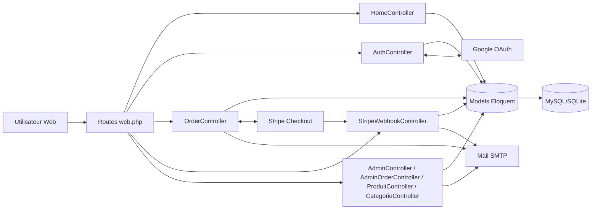
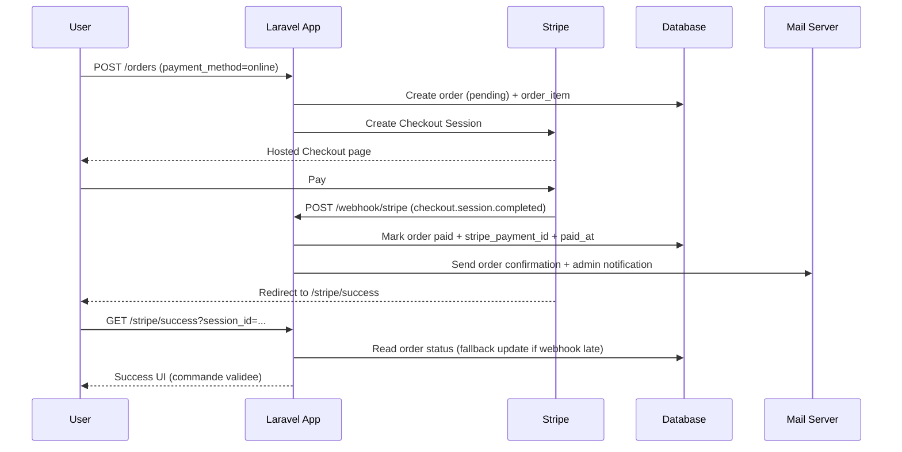
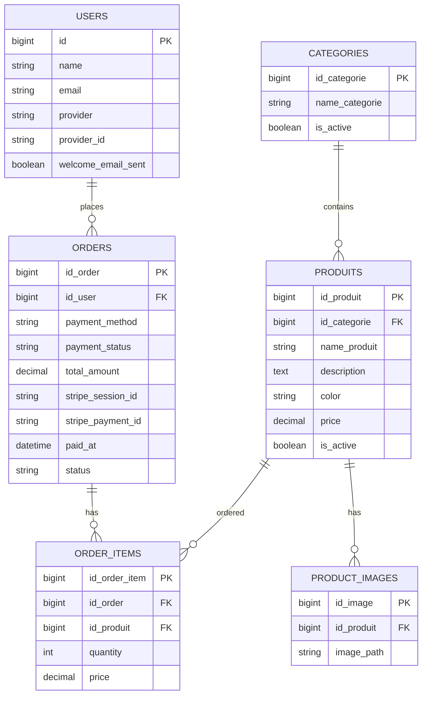

# OUCHRIF E-Commerce (Laravel + Stripe)

<p align="center">
  
</p>

Application e-commerce construite avec Laravel 12 pour vendre des produits (manettes PS5), avec:
- vitrine publique
- authentification locale + Google OAuth
- commande avec paiement a la livraison ou Stripe Checkout
- back-office admin pour produits, categories et commandes
- emails de notification (client + admin)
- support multilingue FR/AR (AR en RTL)

## Sommaire
1. Vue d'ensemble
2. Fonctionnalites
3. Stack technique
4. Architecture et communication (diagrammes)
5. Installation locale
6. Variables d'environnement
7. Configuration Stripe
8. Configuration Google OAuth
9. Acces admin
10. Routes principales
11. Structure du projet
12. Flux fonctionnels
13. Emails envoyes
14. Tests
15. Deploiement
16. Depannage rapide

## 1. Vue d'ensemble

Le projet suit une architecture MVC Laravel classique:
- `routes/web.php` expose les routes web
- controllers dans `app/Http/Controllers`
- logique metier dans les models Eloquent
- rendu UI avec Blade dans `resources/views`
- base de donnees MySQL/SQLite via migrations
- integrations externes: Stripe, Google, SMTP

## 2. Fonctionnalites

### Cote client
- Page d'accueil produit (`/`)
- Catalogue avec filtres (`/produits`)
: recherche, categories, intervalle de prix
- Detail produit (`/produits/{id}`)
- Commande (`/produits/{id}/commande`) reservee aux utilisateurs connectes
- Paiement:
: `cash` (a la livraison)
: `online` via Stripe Checkout
- Login/Register classique
- Login Google (`/auth/google/redirect`)
- Reset password (email + token)
- Changement de langue (`/lang/fr`, `/lang/ar`)

### Cote admin
- Dashboard admin (`/admin`)
- CRUD categories
- CRUD produits + upload images
- Gestion commandes:
: consultation
: edition statut/paiement
: marquer livree
: annuler
: generation facture PDF
: envoi facture par email

## 3. Stack technique

- PHP `^8.2`
- Laravel `^12.0`
- Stripe PHP SDK `^19.3`
- Laravel Socialite `^5.24`
- DomPDF `^3.1`
- Blade + Tailwind CSS + Alpine.js
- DB: MySQL ou SQLite

## 4. Architecture et communication (diagrammes)

### 4.1 Diagramme global



### 4.2 Sequence paiement en ligne (Stripe)



### 4.3 Schema simplifie des donnees



## 5. Installation locale

### 5.1 Prerequis

- PHP >= 8.2
- Composer
- MySQL ou SQLite
- Node.js/NPM (optionnel)
- Stripe CLI (optionnel, pour webhook local)

### 5.2 Etapes

```bash
git clone <repo-url>
cd laravel-ecommerce-stripe
composer install
cp .env.example .env
php artisan key:generate
```

Configurer ensuite la DB dans `.env`, puis:

```bash
php artisan migrate
```

Optionnel:

```bash
php artisan db:seed
```

Lancer l'app:

```bash
php artisan serve
```

Application disponible sur `http://127.0.0.1:8000`.

### 5.3 Sessions database (important)

Le dashboard admin lit la table `sessions`.
Si vous utilisez `SESSION_DRIVER=database`, creez la migration sessions si absente:

```bash
php artisan session:table
php artisan migrate
```

Sinon utilisez:

```env
SESSION_DRIVER=file
```

## 6. Variables d'environnement

Variables minimales a definir (en plus de `.env.example`):

```env
APP_NAME=OUCHRIF
APP_URL=http://127.0.0.1:8000

DB_CONNECTION=mysql
DB_HOST=127.0.0.1
DB_PORT=3306
DB_DATABASE=ouchrif
DB_USERNAME=root
DB_PASSWORD=

MAIL_MAILER=smtp
MAIL_HOST=smtp.gmail.com
MAIL_PORT=587
MAIL_USERNAME=...
MAIL_PASSWORD=...
MAIL_ENCRYPTION=tls
MAIL_FROM_ADDRESS=...
MAIL_FROM_NAME="${APP_NAME}"
ADMIN_EMAIL=admin@example.com

GOOGLE_CLIENT_ID=
GOOGLE_CLIENT_SECRET=
GOOGLE_REDIRECT_URI=http://127.0.0.1:8000/auth/google/callback

STRIPE_KEY=pk_test_...
STRIPE_SECRET=sk_test_...
STRIPE_WEBHOOK_SECRET=whsec_...
```

## 7. Configuration Stripe

### 7.1 Webhook local (Stripe CLI)

```bash
stripe login
stripe listen --forward-to localhost:8000/webhook/stripe
```

Copier le secret donne par Stripe CLI dans:
- `STRIPE_WEBHOOK_SECRET`

### 7.2 Route webhook

- Route: `POST /webhook/stripe`
- Controleur: `StripeWebhookController@handle`
- CSRF: exclue dans `bootstrap/app.php`

## 8. Configuration Google OAuth

Dans Google Cloud Console:
- ajouter URL de callback:
`http://127.0.0.1:8000/auth/google/callback`

Puis definir:
- `GOOGLE_CLIENT_ID`
- `GOOGLE_CLIENT_SECRET`
- `GOOGLE_REDIRECT_URI`

## 9. Acces admin

Actuellement, l'acces dashboard est controle par email hardcode:
- `saidouchrif16@gmail.com`

Fichier:
- `app/Http/Controllers/AdminController.php`

Si vous voulez un autre admin, modifiez cette condition ou mettez un vrai systeme de roles.

## 10. Routes principales

| Route | Methode | Description |
|---|---|---|
| `/` | GET | Landing produit |
| `/produits` | GET | Catalogue + filtres |
| `/produits/{id}` | GET | Detail produit |
| `/produits/{id}/commande` | GET | Form commande (auth) |
| `/orders` | POST | Creation commande |
| `/stripe/success` | GET | Retour paiement ok |
| `/stripe/cancel` | GET | Retour paiement annule |
| `/webhook/stripe` | POST | Webhook Stripe |
| `/register` `/login` | GET/POST | Auth locale |
| `/auth/google/redirect` | GET | OAuth Google |
| `/auth/google/callback` | GET | Callback Google |
| `/forgot-password` | GET/POST | Demande reset |
| `/reset-password/{token}` | GET | Form reset |
| `/reset-password` | POST | Validation reset |
| `/lang/{locale}` | GET | Switch langue FR/AR |
| `/admin/...` | REST | Back-office (auth) |

## 11. Structure du projet

```text
app/
  Http/Controllers/
  Http/Middleware/SetLocale.php
  Mail/
  Models/
bootstrap/app.php
config/services.php
config/mail.php
database/migrations/
lang/fr, lang/ar
resources/views/
  home/
  auth/
  admin/
  emails/
routes/web.php
```

## 12. Flux fonctionnels

### 12.1 Commande cash
1. User ouvre la page commande (auth)
2. `POST /orders` avec `payment_method=cash`
3. Creation order + order_item
4. Envoi emails client/admin
5. Retour sur la page commande avec message de succes

### 12.2 Commande online
1. `POST /orders` avec `payment_method=online`
2. Creation order pending + order_item
3. Redirection Stripe Checkout
4. Stripe webhook marque la commande paid
5. Emails envoyes
6. Redirect user vers `/stripe/success`

## 13. Emails envoyes

- `WelcomeUserMail` (inscription / premier login)
- `OrderConfirmationMail` (client)
- `NewOrderAdminMail` (admin)
- `AdminOrderStatusUpdateMail` (admin, changement statut)
- facture PDF envoyee depuis `AdminOrderController@sendInvoice`

## 14. Tests

Lancer:

```bash
php artisan test
```

Le dossier `tests/Feature/Auth` contient surtout des tests auth de base Laravel.

## 15. Deploiement

Checklist mini:
- `APP_ENV=production`
- `APP_DEBUG=false`
- DB prod configuree
- SMTP prod configure
- cles Stripe prod configurees
- webhook Stripe prod pointe vers `https://<domain>/webhook/stripe`
- optimiser Laravel:

```bash
php artisan config:cache
php artisan route:cache
php artisan view:cache
php artisan optimize
```

## 16. Depannage rapide

- Erreur webhook Stripe:
: verifier `STRIPE_WEBHOOK_SECRET`
: verifier endpoint `/webhook/stripe`

- Impossible d'entrer dans admin:
: verifier email dans `AdminController`

- Erreur reset password / mails:
: verifier config SMTP et `MAIL_FROM_*`

- Erreur session table manquante:
: creer migration sessions (voir section 5.3)

---

Si vous voulez, je peux aussi vous generer:
- un `README-DEV.md` (workflow equipe)
- un `README-DEPLOY.md` (Nginx + SSL + queue worker)
- un schema UML plus detaille (classes/controllers/services)
